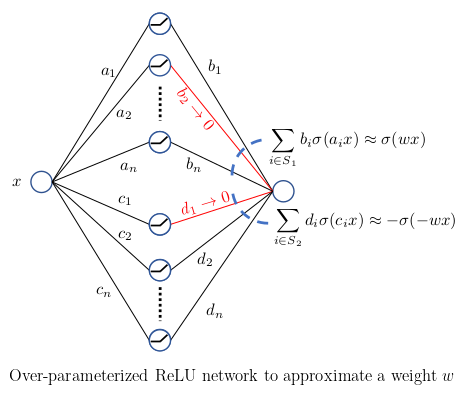
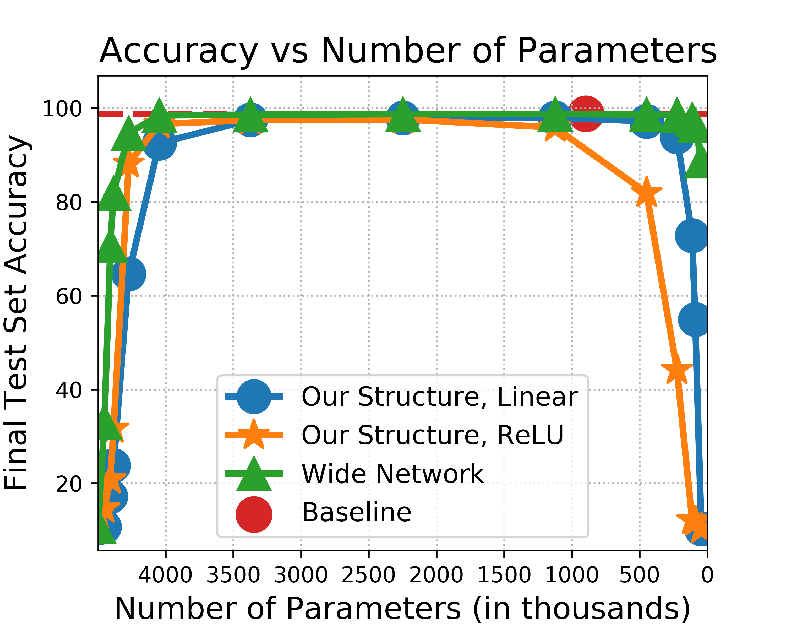

# Optimal Lottery Tickets via SubsetSum: Logarithmic Over-Parameterization is Sufficient
Ankit Pensia, Shashank Rajput, Alliot Nagle, Harit Vishwakarma, Dimitris Papailiopoulos

This repository is the official implementation of [Optimal Lottery Tickets via SubsetSum: Logarithmic Over-Parameterization is Sufficient
](https://arxiv.org/abs/2006.07990). 

<p align="center"></p>

## Setup
Python 3.6.9, CUDA Version 10.2  
Create a new python environment and install all package dependencies provided in requirements.txt. Once your environment is created, you can install the package dependencies by following the instructions below.

### Installing gurobipy

Only Experiment 1 from our paper uses a package called gurobipy, which is a package developed by Gurobi for modeling and solving optimization problems. gurobipy is installed differently depending on the package manager you're using:
- Install gurobipy with Anaconda
    - [Gurobi and Anaconda for Mac](https://www.gurobi.com/gurobi-and-anaconda-for-mac/)
    - [Gurobi and Anaconda for Windows](https://www.gurobi.com/gurobi-and-anaconda-for-windows/)
    - [Gurobi and Anaconda for Linux](https://www.gurobi.com/gurobi-and-anaconda-for-linux/)
- Install gurobipy with pip
    - [Gurobi and pip for Mac](https://www.gurobi.com/documentation/9.0/quickstart_mac/the_grb_python_interface_f.html)
    - [Gurobi and pip for Windows](https://www.gurobi.com/documentation/9.0/quickstart_windows/the_grb_python_interface_f.html)
    - [Gurobi and pip for Linux](https://www.gurobi.com/documentation/9.0/quickstart_linux/the_grb_python_interface_f.html)

Once gurobipy is installed, a license is required to use the package; Gurobi offers unlimited free academic licenses. Information about downloading Gurobi and obtaining a license may be found at:
- [Academic Program and Licenses](https://www.gurobi.com/academia/academic-program-and-licenses/)
- [Gurobi Downloads](https://www.gurobi.com/downloads/)

Gurobi also provides quickstart guides:
- [Mac Quickstart](https://www.gurobi.com/wp-content/plugins/hd_documentations/documentation/9.0/quickstart_mac.pdf)
- [Windows Quickstart](https://www.gurobi.com/wp-content/plugins/hd_documentations/documentation/9.0/quickstart_windows.pdf)
- [Linux Quickstart](https://www.gurobi.com/wp-content/plugins/hd_documentations/documentation/9.0/quickstart_linux.pdf)

If you're using Anaconda, you just need to make sure that you add the Gurobi channel before installing from requirements.txt:

```conda channel
conda config --add channels http://conda.anaconda.org/gurobi
```

If you're using pip, see the above documentation to correctly setup gurobipy before installing it to your environment

### Requirements
Once you have completed the steps above, you may install all of the requirements to your environment with either of the following commands, depending on your package manager of choice.

```setup pip
pip install -r requirements.txt 
```

or with

```setup conda
conda install --file requirements.txt
```

## Experiments
In both experiment directories, subset-sum and pruning, one or more bash scripts contain all commands to reproduce the results in the experiments provided in the paper. Please run

```help
python main.py --help
```

in the terminal to see information about all arguments and their default values. In order to execute a script, run the following commands:

```chmod
chmod u+x script.sh
```

only once to allow the script to be executable, and then run

```ex script
./script.sh
```

to execute the script. If you would like to execute a script in the background and save all output to an output file, you may replace the above command with:

```bkg ex script
nohup ./script.sh > script.out &
```

### Experiment 1: SubsetSum
Due to the hardness of the SubsetSum problem, it can take a long time to solve SubsetSum for all 397,000 parameters of a two-layer fully connected network. Our experiments use [Gurobi's MIP solver](https://www.gurobi.com/resource/mip-basics/). Our implemention will utilize all cores on a machine to solve each SubsetSum problem; to limit the core usage, we recommend running the experiment in the following way:

```cpu limit
taskset -c 1-16 nohup ./run.sh > run.out &
```

This limits the number of cores used when executing run.sh to be between 1 and 16. Since every python script is run one at a time within run.sh, executing run.sh in this way will dedicate 1 to 16 cores to main.py. Nearly all of these cores will be dedicated to solving each SubsetSum instance once that part of the code is reached. The approximation of a two-layer fully connected network presented in our paper completed in about 21.5 hours on 36 cores of a c5.18xlarge AWS EC2 instance.

While most arguments to main.py are self-explanatory, there are a few arguments that would benefit from further explanation. Arguments --c and --epsilon determine the number of a\_i coefficents used to approximate every weight in a target network via SubsetSum. The number of a\_i coefficients is given by n = round(c * log2(1 / epsilon)). The --check\_w\_lt\_eps argument, when enabled, will check whether a weight magnitude is less than or equal to epsilon before running SubsetSum on that weight value. If the magnitude is less than or equal to epsilon, the weight is approximated to be zero. This allows the script to terminate much earlier, have all weights approximations be within epsilon error, and the approximated target network will still have an accuracy very close to the target network.

In the subuset-sum directory, a run.sh script contains the necessary commands to reproduce our results.

### Experiment 2: Pruning Random Networks

Although most arguments used when running main.py are self-explanatory, some arguments and naming conventions deserve a more thorough explanation:

1. Throughout the code, the word "redundant" (sometimes shortened to the prefix "red") occurs frequently. This is a naming convention that refers to our structure. Essentially, our structure introduces some "redundancy" into a given architecture by replacing a single weight value with r different weight values, which are then pruned. The number of redundant units in a network with our structure is specified by the argument --redundancy. For example, running  
    ```red
    python main.py --model "RedTwoLayerFC" --redundancy 5
    ```  
    instructs main.py to run an experiment for a two-layer fully connected network with our structure and 5 units of redundancy.
 
2. For networks that use our structure and for baseline networks, the argument --hidden-size  works as one might expect: it specifies the number of hidden nodes in the fully connected layers of a network. There are two exceptions to this rule: (1) LeNet5 architectures have a predetermined number of hidden nodes based on the literature, so --hidden-size is ignored. (2) When pruning a wide network, such as "WideTwoLayerFC" (wide two-layer fully connected network), the number of hidden nodes in the architecture is calculated based off the value specified by --hidden-size and --redundancy. The the number hidden nodes are calculated this way so that the number of parameters in a wide network approximately match the number of parameters in a network that uses our structure. For example, if a "RedTwoLayerFC" (our network) is defined for --hidden-size 500 and --redundancy 5, then defining a "WideTwoLayerFC" with --hidden-size 500 and --redundancy 5 will prune a wide network with the approximately the same number of parameters as the "RedTwoLayerFC" network.

3. To avoid confusion, the sparsity argument has the following interpretation: a sparsity of 0 means "no sparsity" (i.e. "keep all the weights") and a sparsity of 1 means "complete sparsity" (i.e. "prune all the weights"). By this convention, a sparsity of 0.75 means "keep 25% of the weights."

In the pruning directory, there are three bash scripts for our experiments: (1) base.sh contains all the commands for our baseline network results, (2) fc.sh contains all the commands for two- and four-layer fully connected networks that use our redundant structure and the widened networks, and (3) lenet5.sh contains all the commands for our implementing our pruned redundant structure and the wide fully connected layers on LeNet5.

## Results (MNIST)
### Experiment 1
| Model  | Inital Params | Remaining Params | Relative Size to Target After Pruning  | MNIST Accuracy |
| :-------------: | :-------------: | :-------------: | :-------------: | :-------------: |
| Target Two-Layer FC  |  397k  | 397k | 1 (not pruned) | 97.19% |
| Pruned Two-Layer FC  |  8.34M | 3.73M | 9.39 | 97.19% |

### Experiment 2

#### Two-Layer Fully Connected
<p align="center"></p>

#### Four-Layer Fully Connected
<p align="center"></p>

#### LeNet5
<p align="center"></p>

## Updates
We thank Eddie Xiong for identifying a small bug in our code.
```python
approx_test_acc = utils.test(model, device, criterion, test_loader, args.batch_size)
```
on line 207 of subset-sum/main.py has been updated to 
```python
approx_test_acc = utils.test(approx_model, device, criterion, test_loader, args.batch_size)
```
